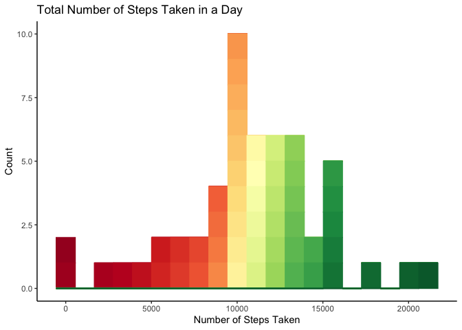
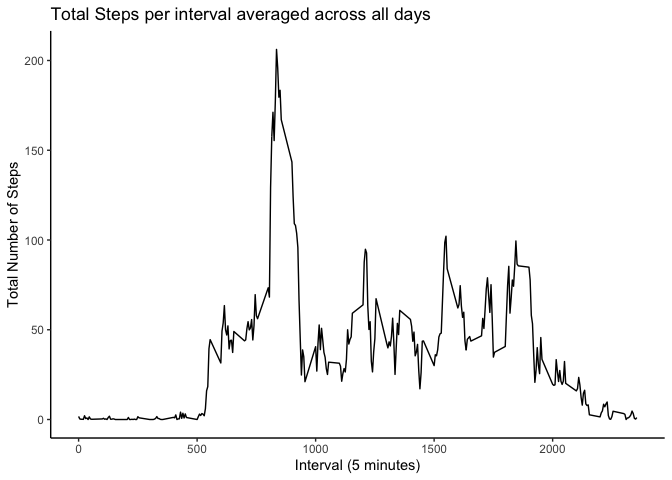
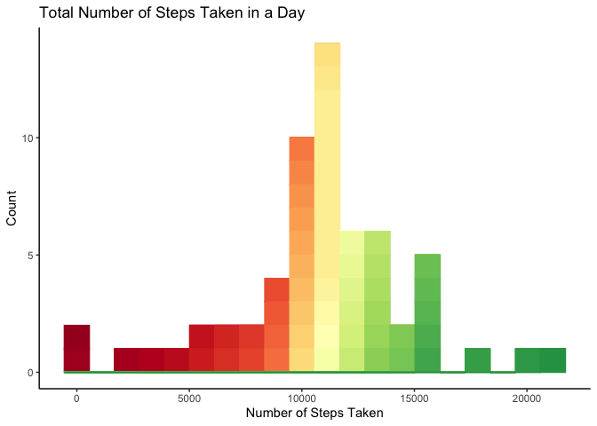
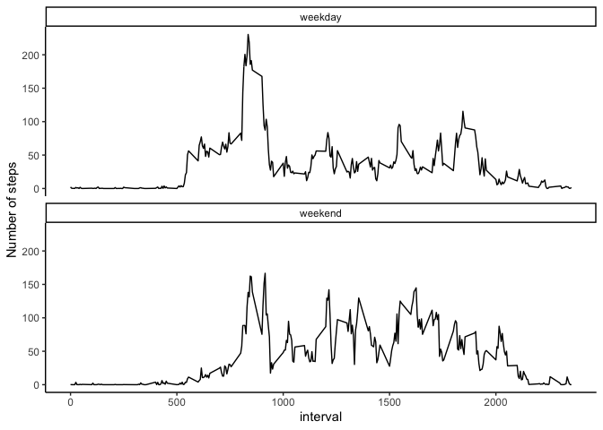

# Introduction
It is now possible to collect a large amount of data about personal movement using activity monitoring devices such as a [Fitbit](https://www.fitbit.com/in/home), [Nike Fuelband](https://www.nike.com/help/a/why-cant-i-sync), or [Jawbone Up](https://jawbone.com/up). These type of devices are part of the “quantified self” movement – a group of enthusiasts who take measurements about themselves regularly to improve their health, to find patterns in their behavior, or because they are tech geeks. But these data remain under-utilized both because the raw data are hard to obtain and there is a lack of statistical methods and software for processing and interpreting the data.

This analysis makes use of data from a personal activity monitoring device. This device collects data at 5 minute intervals through out the day. The data consists of two months of data from an anonymous individual collected during the months of October and November, 2012 and include the number of steps taken in 5 minute intervals each day.

The data for this assignment can be downloaded from [here](https://d396qusza40orc.cloudfront.net/repdata%2Fdata%2Factivity.zip)

The variables included in this dataset are:

- **steps**: Number of steps taking in a 5-minute interval (missing values are coded as NA

- **date**: The date on which the measurement was taken in YYYY-MM-DD format

- **interval**: Identifier for the 5-minute interval in which measurement was taken

The dataset is stored in a comma-separated-value (CSV) file and there are a total of 17,568 observations in this dataset.

## Loading and preprocessing the data for the initial analysis when NA values are removed
The data has to be in the working directory of the user for this code to run correctly. The activity.csv file has to be downloaded from the internet and saved in the working directory. The *date* column is initially a string, so is converted to the date class. Requisite packages are loaded.

```r
library(ggplot2)
library(RColorBrewer)
raw_data <- read.csv("./activity.csv", stringsAsFactors = FALSE)
data <- raw_data[complete.cases(raw_data), ]
data$date <- as.Date(data$date, format = "%Y-%m-%d")
```

## Mean and median of total number of steps taken per day

Missing values are ignored. The total number of steps taken on every date is found.

```r
daily_steps <- aggregate(steps ~ date, data, sum)
```

A histogram, which is an exploratory plot is plotted using the ggplot2 package to take a peek at the data and spot any obvious patterns. RColorBrewer package is used to colour the data from red to green, with green representing the largest number of steps walked per day (walking is healthy) and red representing the least (unhealthy).

```r
mycolours <- colorRampPalette(brewer.pal(11, "RdYlGn"))(53)
ggplot(daily_steps, aes(x = steps)) + geom_histogram(bins = 20, aes(fill = as.factor(steps), color = as.factor(steps))) +  theme_classic() + scale_fill_manual(values = mycolours) + scale_color_manual(values = mycolours) + xlab("Number of Steps Taken") + ggtitle("Total Number of Steps Taken in a Day") + theme(legend.position = "none") + ylab("Count") 
```

<!-- -->

Mean of total number of steps per day is calculated:

```r
mean(daily_steps$steps)
```

```
## [1] 10766.19
```
Median of total number of steps per day is calculated:

```r
median(daily_steps$steps)
```

```
## [1] 10765
```

## Average daily activity during 5 minute intervals of time
The average number of steps per interval over all days is calculated.

```r
interval_steps <- aggregate(steps ~ interval, data, mean)
```
The ggplot2 package is again leveraged to make a time-series plot of the average number of steps across all days taken against intervals of 5 minutes

```r
ggplot(interval_steps, aes(x = interval, y = steps)) +geom_line() + theme_classic() + xlab("Interval (5 minutes)") + ylab("Total Number of Steps") + ggtitle("Total Steps per interval averaged across all days")
```

<!-- -->

The interval containing the maximum number of steps (across all days) is calculated

```r
interval_steps$interval[which(interval_steps$steps == max(interval_steps$steps))]
```

```
## [1] 835
```


## Accounting for and imputing missing values
The below code helps find where and how much missing data there is. There're 2304 instances of missing data and all are in the *steps* column. 

```r
sum(!complete.cases(raw_data))
```

```
## [1] 2304
```

```r
sum(is.na(raw_data$steps))
```

```
## [1] 2304
```

```r
sum(is.na(raw_data$interval))
```

```
## [1] 0
```

```r
sum(is.na(raw_data$date))
```

```
## [1] 0
```
An imputing strategy is to replace all missing values in *steps* with the average value of that interval over all days, when the missing data is excluded. 
To achieve this, I merge *raw_data* and *interval_steps* by *interval* and using the *ifelse* function, calculate all *step* (a new column called such is created) values that aren't there with the ones from *interval_steps*. *steps.x* and *steps.y* are removed leaving only the main *steps* column. The date is also formatted appropriately

```r
updated_data <- merge(raw_data, interval_steps, by = "interval")
updated_data$steps <- updated_data$steps.x
updated_data$steps <- ifelse(is.na(updated_data$steps.x), updated_data$steps.y, updated_data$steps.x)
updated_data <- updated_data[, -c(2, 4)]
updated_data$date <- as.Date(updated_data$date, format = "%Y-%m-%d")
```
Now, once again, using the same process as before, a histogram of the total number of steps per day across all intervals is plotted with the updated imputed data. colorRampPalette is called with 61 as the argument as if you look at the *updated_daily_steps*, you will notice that there are 61 rows now, as opposed to 53 earlier. This is done as the *steps* are made into factors while filling and colouring. 

```r
updated_daily_steps <- aggregate(steps ~ date, updated_data, sum)
updated_mycolours <- colorRampPalette(brewer.pal(11, "RdYlGn"))(61)
ggplot(updated_daily_steps, aes(x = steps)) + geom_histogram(bins = 20, aes(fill = as.factor(steps), color = as.factor(steps))) +  theme_classic() + scale_fill_manual(values = updated_mycolours) + scale_color_manual(values = updated_mycolours) + xlab("Number of Steps Taken") + ggtitle("Total Number of Steps Taken in a Day") + theme(legend.position = "none") + ylab("Count") 
```

<!-- -->

The mean and median of the imputed data is also calculated in a similar way.

```r
mean(updated_daily_steps$steps)
```

```
## [1] 10766.19
```

```r
median(updated_daily_steps$steps)
```

```
## [1] 10766.19
```

The means and medians from the imputed data and the intial data where missing values are excluded are compared. The means remain the same while the median of imputed data is lower than that of the initial unimputed data. 
The two values are similar or almost the same due to the way the imputing was done- using averaging functions

```r
rbind(initial_mean = mean(updated_daily_steps$steps), initial_median = median(updated_daily_steps$steps), imputed_mean = mean(daily_steps$steps), imputed_median = median(daily_steps$steps))
```

```
##                    [,1]
## initial_mean   10766.19
## initial_median 10766.19
## imputed_mean   10766.19
## imputed_median 10765.00
```
## Differences in activity patterns between weekends and weekdays
The *weekdays* function was used along with the *ifelse* function to create a new column called *weekend* which is a factor variable with 2 possible values - *weekday* and *weekend*

```r
updated_data$weekend <- ifelse(weekdays(updated_data$date) == "Sunday" | weekdays(updated_data$date) == "Saturday", "weekend", "weekday")
updated_data$weekend <- as.factor(updated_data$weekend)
```
The average number of steps over all intervals is calculated in a similar way except it is grouped by the *weekend* factor first before the *interval*. 

```r
weekday <- aggregate(steps ~ weekend + interval, updated_data, mean)
```
A panel plot is made with the weekend and weekday against the intervals. 
They seem similar, but on weekends, it seems like activity takes more time intervals to pick up and the maximum steps on any interval is also greater on weekdays.

```r
ggplot(weekday, aes(x = interval, y = steps)) + geom_line() + facet_wrap(weekend ~ . , nrow = 2) + theme_classic() + ylab("Number of steps")
```

<!-- -->


